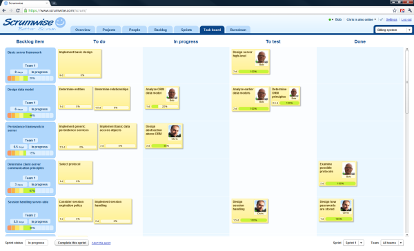
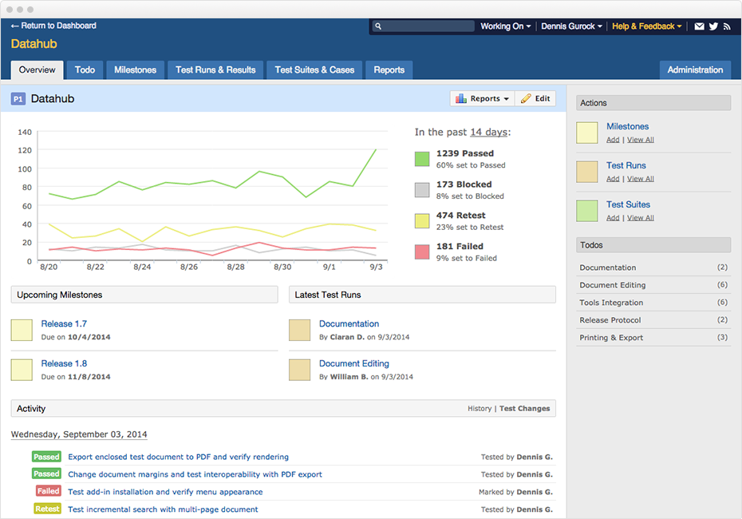
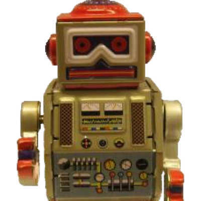

QA
==
**HumanTalk**

*February 2017*

About me
========
Former QA working at `Stormshield <https://www.stormshield.eu/fr>`_

`Nabil BENDAFI <nabil.bendafi@stormshield.eu>`_

Summary
=======
* Scrum
* What is a QA ?
* When QA is needed ?
* Tools
* DoD

Scrum
=====
 * Product Owner
 * Scrummaster
 * Engineer (QA and development)

What is a QA ?
==============

.. class:: hide-title

.
=

When QA is needed?
------------------

Beginning ...
-------------

* Sprint planning
* Prepare tests
* Poker planning
    - Stories estimation
    - AC definition

... During ...
--------------

  * Daily Standup meeting
  * Test plan creation/execution
  * Feature demonstration
  * Automate regression tests

... End
-------

  * Sprint demo
  * Sprint retrospective

.. class:: hide-title

.
=

Tools
-----

Scrumboard
----------

Tests
-----

Test runner
-----------

DoD
===
Master of **DoD** (Definition of Done)

References
==========
* `My Experience as a QA in Scrum <https://www.infoq.com/articles/experience-qa-scrum>`_ Priyanka Hasija 
* `QA Role in Scrum <http://www.uploads.pnsqc.org/2013/papers/t-024_Wysopal_paper.pdf>`_ Karen Ascheim Wysopal

Thanks
======
Stormshield is recruiting !
